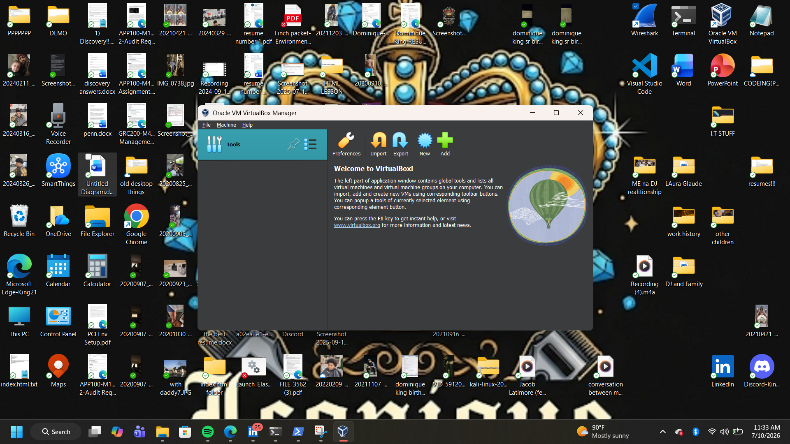
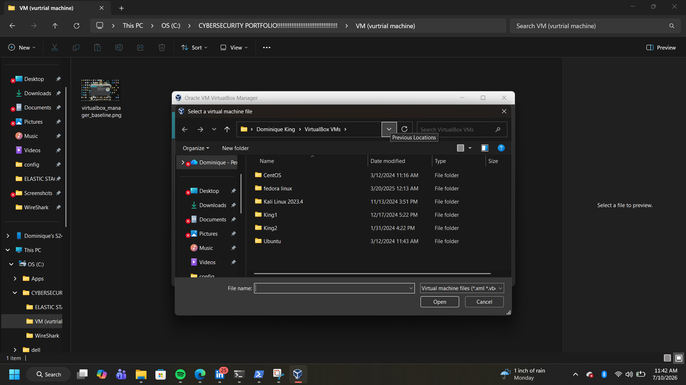
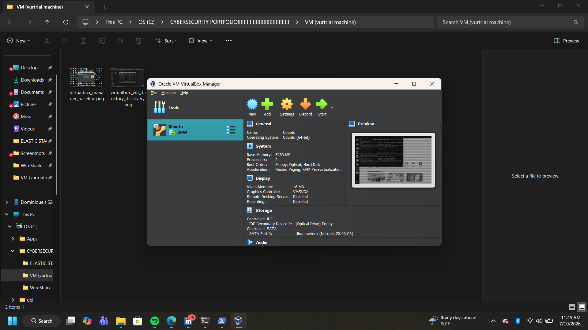
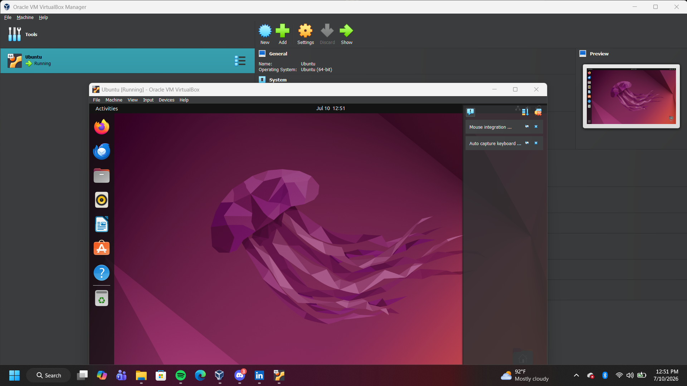
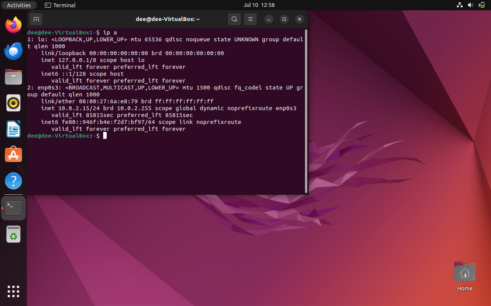
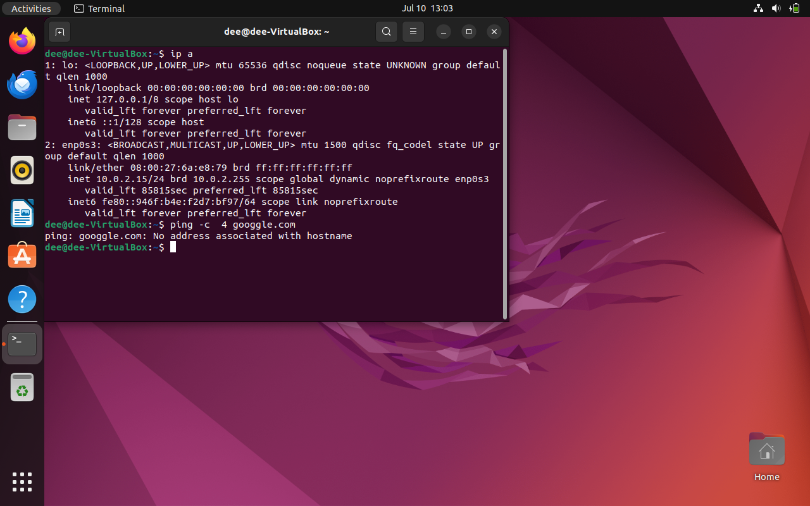
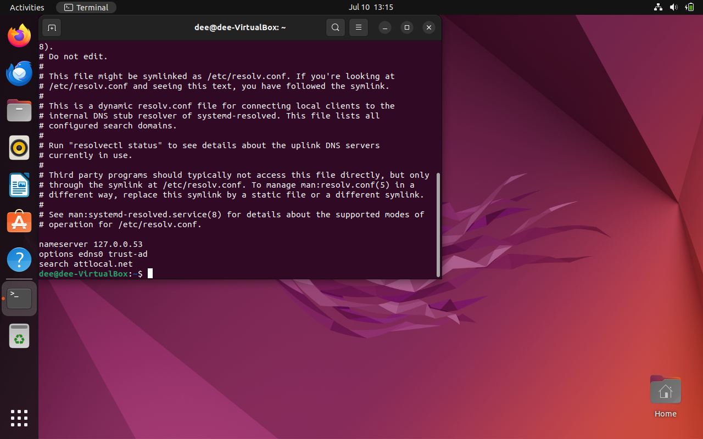
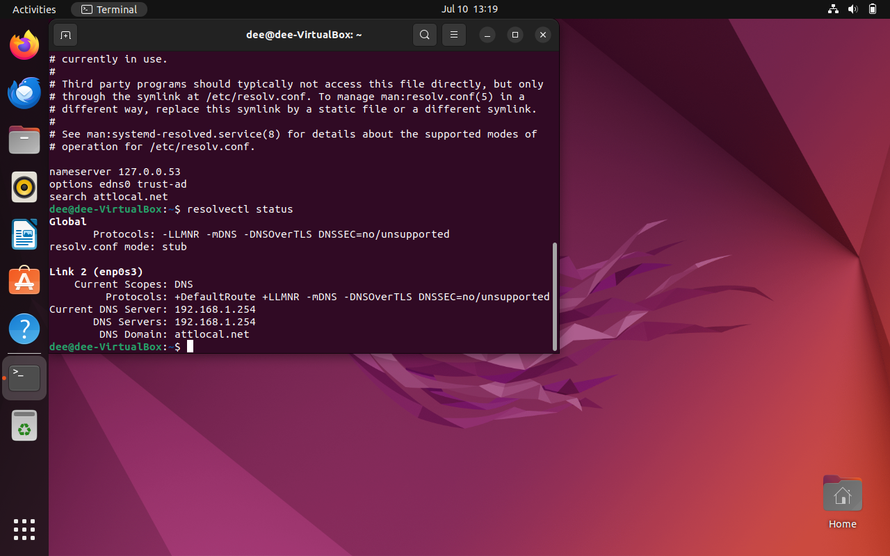
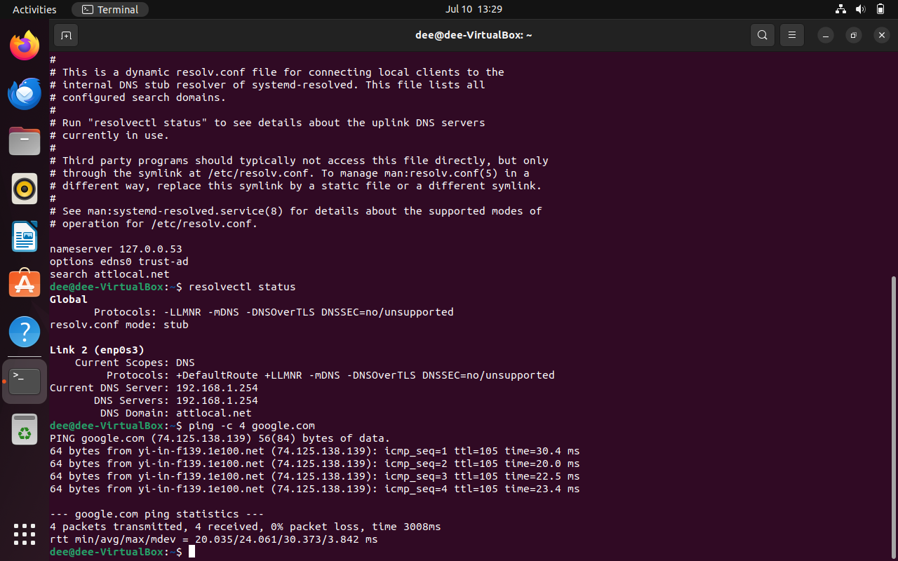
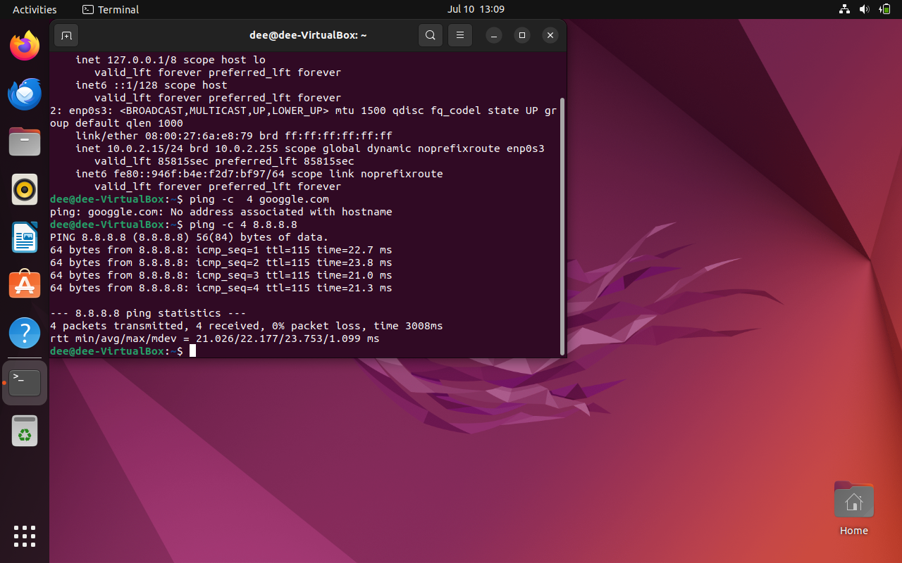

# Virtualization & Network Remediation Lab

Isolated Type-2 hypervisor sandbox architecture and Layer 3 network routing remediation lab. This project documents the end-to-end environment deployment, virtual network staging, fault identification, and core configuration fixes.

## Project Deliverables
* **[Click here to view my full Technical Lab Report (PDF)](virtualization_and_network_remediation_lab.pdf)**

---

## Project Walkthrough & Technical Milestones

### Phase 1: Hypervisor Provisioning & VM Registration
The Type-2 virtualization workspace was initialized using Oracle VM VirtualBox. The underlying VM data structures and directories were mapped out and parsed to successfully register the Linux guest kernel baseline onto the hypervisor control board.

### Phase 2: Guest OS Deployment & Interface Auditing
The target guest operating system was safely booted within the sandboxed compute layer. Initial administrative shells were launched to verify system runtime stability and query local network interface attributes.

### Phase 3: Outbound Path Interruption & DNS Fault Identification
During initial system updates, a total outbound packet drop was observed when querying public web assets. Network triage pinpointed a standard name resolution failure. Advanced diagnosis mapped the failure to a loop error in the local stub-resolver configuration, entirely blocking external DNS resolution.

### Phase 4: Core Configuration & Stub-Resolver Remediation
The internal network resolution paths were systematically updated. By restructuring the runtime configurations, the broken internal loop was bypassed, forcing the guest OS to route queries out to verified, stable upstream network server sources.

### Phase 5: Final Connectivity & Live Routing Verification
With configurations successfully patched, full terminal ping metrics were run targeting external public IP environments. The system verified absolute resolution health with zero packet loss, confirming a fully operational and stable network state.

